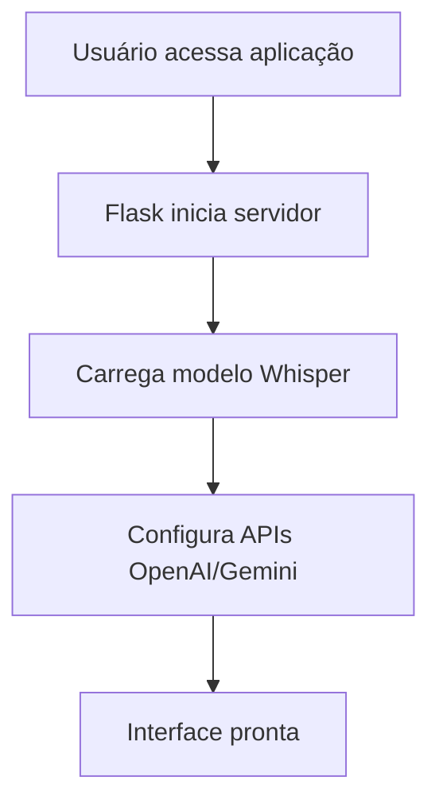
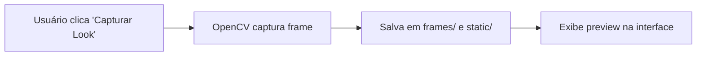
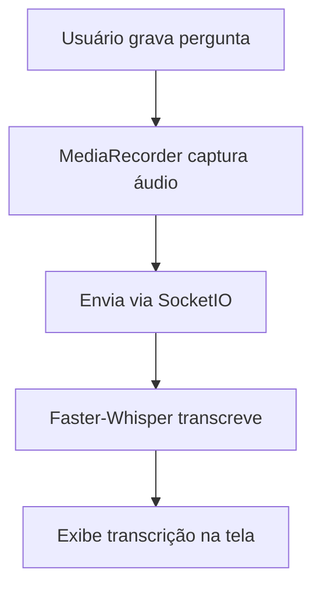
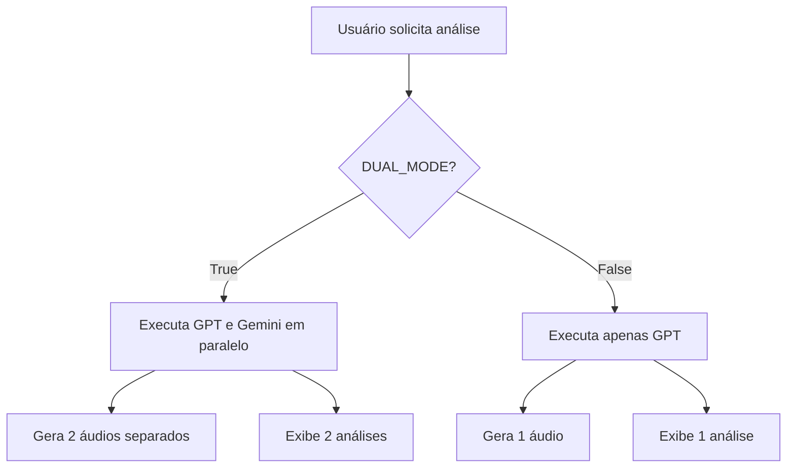
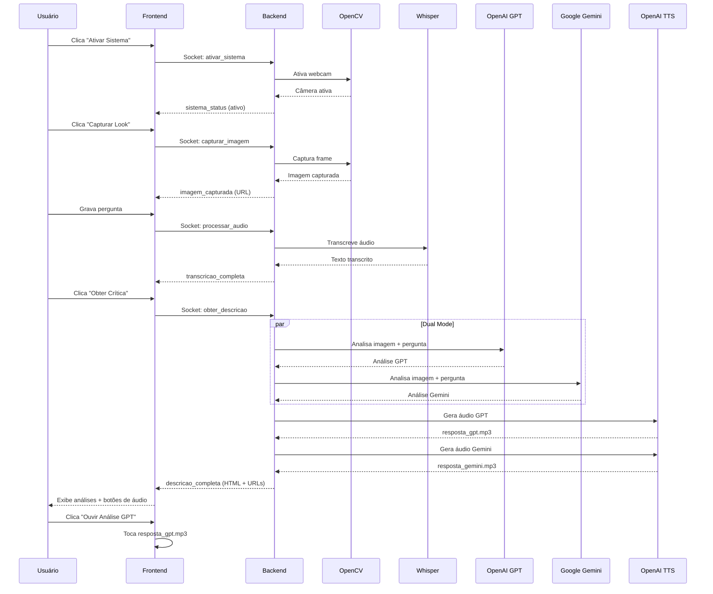

# 📊 StyleVision - Documentação Técnica

## 🎯 O que é o Projeto?

**StyleVision** é um consultor de moda inteligente baseado em IA que permite aos usuários:

1. **Enviar uma imagem** do seu look (via webcam ou upload)
2. **Fazer uma pergunta** sobre a adequação da roupa para um contexto específico
3. **Receber feedback especializado** de múltiplos consultores virtuais de moda

### 💎 O Diferencial

O grande diferencial do StyleVision é oferecer **diferentes opiniões** sobre o mesmo look, utilizando modelos de IA distintos:

- **GPT-4o-mini (OpenAI)** - Análise técnica e estruturada
- **Gemini 2.5 Flash (Google)** - Perspectiva alternativa e complementar

Isso permite ao usuário ter uma visão mais completa e equilibrada sobre suas escolhas de moda, similar a consultar diferentes estilistas profissionais.

### 🎨 Experiência do Usuário

O sistema funciona de forma simples e intuitiva:
- Captura ou envia uma foto do look
- Grava uma pergunta por voz (ex: "Este look funciona para uma reunião de negócios?")
- Recebe análises escritas e em áudio de consultores virtuais especializados
- Cada consultor fornece: veredito, sugestões de correção e dicas de styling

---

## 🏗️ Arquitetura do Projeto

```
ProjetoMultimidia/
├── app.py                 # Backend Flask + SocketIO
├── templates/
│   └── index.html         # Frontend (interface web)
├── static/
│   ├── captured.jpg       # Imagem capturada da câmera
│   ├── resposta_gpt.mp3   # Áudio gerado pelo GPT
│   ├── resposta_gemini.mp3 # Áudio gerado pelo Gemini
│   └── temp_audio.wav     # Áudio temporário da pergunta
├── frames/
│   └── captured_frame.jpg # Frame capturado
├── .env                   # Variáveis de ambiente (API keys)
├── .gitignore             # Arquivos ignorados pelo git
├── pyproject.toml         # Dependências do projeto
└── README.md              # Documentação do projeto
```

---

## 🔄 Fluxo de Funcionamento

### 1. Inicialização do Sistema



**Código de inicialização:**

```python
# app.py - Linha 27-30
app = Flask(__name__)
app.config['SECRET_KEY'] = 'gior-secret-key-2025'
socketio = SocketIO(app, cors_allowed_origins="*")

# Linha 90-97
self.client = OpenAI()
self.llm = ChatOpenAI(model='gpt-4o-mini', temperature=0, max_tokens=256)

# Whisper - usando modelo menor e mais rápido
print("Carregando modelo Whisper...")
try:
    self.whisper_model = WhisperModel("tiny", device="cpu", compute_type="int8")
    print("Modelo Whisper carregado!")
```

---

### 2. Captura de Imagem



**Implementação:**

```python
# app.py - Método capturar_imagem
def capturar_imagem(self):
    if self.current_frame is not None:
        cv2.imwrite('frames/captured_frame.jpg', self.current_frame)
        self.imagem_capturada = 'frames/captured_frame.jpg'
        
        # Salvar também na pasta static para exibição
        cv2.imwrite('static/captured.jpg', self.current_frame)
        return True
    return False
```

---

### 3. Gravação e Transcrição de Áudio



**Código de transcrição:**

```python
# app.py - Método transcribe_audio
def transcribe_audio(self, audio_file_path):
    try:
        if self.whisper_model is None:
            # Fallback para SpeechRecognition
            with sr.AudioFile(audio_file_path) as source:
                audio = self.recognizer.record(source)
                return self.recognizer.recognize_google(audio, language='pt-BR')
        
        segments, _ = self.whisper_model.transcribe(
            audio=audio_file_path, 
            language='pt', 
            beam_size=5
        )
        transcricao = ""
        for segment in segments:
            transcricao += segment.text + " "
        return transcricao.strip()
```

---

### 4. Análise Dual Mode (GPT + Gemini)



**Implementação do Dual Mode:**

```python
# app.py - handle_descricao (linha 420-445)
if gior.dual_mode:
    print("DEBUG: Executando modo DUAL (OpenAI + Gemini)")
    with concurrent.futures.ThreadPoolExecutor(max_workers=2) as ex:
        fut_openai = ex.submit(gior.obter_resposta, pergunta)
        fut_gemini = ex.submit(gior.obter_analise_gemini, encoded_image, pergunta)
        
        try:
            resposta_gior = fut_openai.result(timeout=60)
        except Exception as e:
            resposta_gior = f"Erro OpenAI: {str(e)}"
            
        try:
            resposta_gemini = fut_gemini.result(timeout=60)
            if not resposta_gemini or resposta_gemini.startswith("Erro"):
                resposta_gemini = "Não foi possível fazer a análise do Gemini."
        except Exception as e:
            resposta_gemini = "Não foi possível fazer a análise do Gemini."
```

---

### 5. Geração de Áudio com OpenAI TTS

```python
# app.py - Método gerar_audio
def gerar_audio(self, texto):
    try:
        response = self.client.audio.speech.create(
            model="tts-1",
            voice="onyx",
            input=texto,
            speed=1.3
        )
        
        audio_path = 'static/resposta.mp3'
        response.stream_to_file(audio_path)
        return audio_path
    except Exception as e:
        print(f"Erro ao gerar áudio: {e}")
        return None
```

---

## 📁 Detalhamento de Arquivos

### **app.py** (Backend Principal)

**Responsabilidades:**
- Servidor Flask + SocketIO para comunicação real-time
- Gerenciamento de câmera (OpenCV)
- Integração com APIs (OpenAI GPT, Google Gemini)
- Transcrição de áudio (Faster-Whisper)
- Geração de áudio (OpenAI TTS)

**Principais Classes:**

```python
class GiorWeb:
    """Classe principal que gerencia todo o sistema"""
    
    def __init__(self):
        # Inicializa modelos de IA
        # Configura câmera
        # Define contexto do consultor de moda
        
    def ativar_camera(self):
        # Liga a webcam
        
    def capturar_imagem(self):
        # Captura e salva frame atual
        
    def obter_resposta(self, pergunta):
        # Obtém resposta do GPT-4o-mini com visão
        
    def obter_analise_gemini(self, encoded_image, pergunta):
        # Obtém resposta do Google Gemini
        
    def gerar_audio(self, texto):
        # Converte texto em áudio
```

**Rotas SocketIO:**

```python
@socketio.on('ativar_sistema')
def handle_ativar():
    # Liga a câmera

@socketio.on('capturar_imagem')
def handle_capturar():
    # Captura foto do look

@socketio.on('processar_audio')
def handle_audio(data):
    # Transcreve áudio da pergunta

@socketio.on('obter_descricao')
def handle_descricao():
    # Executa análise (dual mode ou single)
    # Gera áudios
    # Retorna HTML formatado
```

---

### **templates/index.html** (Frontend)

**Estrutura:**
- **Header:** Título e subtítulo da aplicação
- **Grid Principal:**
  - **Coluna Esquerda:** Vídeo da câmera + preview da imagem capturada
  - **Coluna Direita:** Controles (botões)
- **Seção de Resultados:** Pergunta transcrita + análises + botões de áudio

**Componentes JavaScript:**

```javascript
// Gerenciamento de eventos SocketIO
socket.on('descricao_completa', (data) => {
    // Exibe análises GPT e Gemini
    // Configura botões de áudio separados
    if (data.audio_urls) {
        audioControls.style.display = "block";
        
        if (data.audio_urls.gpt) {
            audioGpt.src = data.audio_urls.gpt + "?t=" + Date.now();
            btnGpt.style.display = "inline-block";
        }
        
        if (data.audio_urls.gemini) {
            audioGemini.src = data.audio_urls.gemini + "?t=" + Date.now();
            btnGemini.style.display = "inline-block";
        }
    }
});

// Botões de áudio com controle manual
document.getElementById("playGptAudio").addEventListener("click", () => {
    const audioGpt = document.getElementById("audioGpt");
    if (audioGpt.src) {
        audioGpt.play();
    }
});
```

**CSS - Hierarquia de Botões:**

```css
/* 1. DESTAQUES (Coloridos) */
.btn-primary {
    background: linear-gradient(135deg, #d4af37 0%, #aa8a2e 100%);
    /* Ativar Sistema */
}

.btn-danger {
    background: linear-gradient(135deg, #c62828 0%, #8e0000 100%);
    /* Desativar Sistema */
}

/* 2. NEUTROS (Cinza) */
#btnGravar, #btnParar, #btnCapturar {
    background: #222 !important;
    border: 1px solid #333 !important;
}

/* 3. BOTÕES DE ÁUDIO (Fundo da página) */
.audio-btn {
    background: radial-gradient(circle at center, #171717, #0d0d0d) !important;
    border: 1px solid #333 !important;
}
```

---

### **static/** (Arquivos Estáticos)

| Arquivo | Descrição |
|---------|-----------|
| `captured.jpg` | Imagem capturada da webcam |
| `resposta_gpt.mp3` | Áudio da análise do GPT |
| `resposta_gemini.mp3` | Áudio da análise do Gemini |
| `temp_audio.wav` | Áudio temporário da pergunta do usuário |

---

### **frames/** (Frames Temporários)

Armazena frames capturados da câmera antes de serem processados.

---

### **.env** (Variáveis de Ambiente)

```env
OPENAI_API_KEY="sk-proj-..."
GEMINI_API_KEY="AIza..."
GEMINI_MODEL="gemini-2.5-flash"
DUAL_MODE=true
```

**Importante:** Este arquivo **não** é versionado no Git (está no `.gitignore`) por conter informações sensíveis.

---

## 🔌 APIs Utilizadas

### 1. **OpenAI GPT-4o-mini**

**Endpoint:** `ChatOpenAI` (via Langchain)

**Uso:** Análise de imagem + texto (visão)

```python
self.llm = ChatOpenAI(model='gpt-4o-mini', temperature=0, max_tokens=256)

# Envio de mensagem com imagem
inputs = [HumanMessage(
    content=[
        {"type": "text", "text": f"{contexto}\n\n{pergunta}"},
        {"type": "image_url", "image_url": {
            "url": f"data:image/jpeg;base64,{encoded_image}"
        }}
    ]
)]
```

---

### 2. **Google Gemini**

**Endpoint:** `https://generativelanguage.googleapis.com/v1beta/models/{model}:generateContent`

**Uso:** Análise alternativa de imagem

```python
def obter_analise_gemini(self, encoded_image, pergunta):
    url = f'https://generativelanguage.googleapis.com/v1beta/{model}:generateContent?key={key}'
    
    payload = {
        "contents": [{
            "parts": [
                {"text": prompt_text},
                {"inline_data": {
                    "mime_type": "image/jpeg",
                    "data": encoded_image
                }}
            ]
        }]
    }
    
    r = requests.post(url, headers=headers, json=payload, timeout=25)
    return r.json()
```

---

### 3. **OpenAI TTS (Text-to-Speech)**

**Modelo:** `tts-1`

**Voz:** `onyx`

```python
response = self.client.audio.speech.create(
    model="tts-1",
    voice="onyx",
    input=texto,
    speed=1.3
)
response.stream_to_file(audio_path)
```

---

### 4. **Faster-Whisper**

**Modelo:** `tiny` (otimizado para CPU)

**Uso:** Transcrição de áudio em português

```python
self.whisper_model = WhisperModel("tiny", device="cpu", compute_type="int8")

segments, _ = self.whisper_model.transcribe(
    audio=audio_file_path, 
    language='pt', 
    beam_size=5
)
```

---

## 🎨 Design da Interface

### Paleta de Cores

```css
/* Background */
background: radial-gradient(circle at center, #171717, #0d0d0d);

/* Cards */
background: #141414;
border: 1px solid #262626;

/* Botões Dourados (Ativar Sistema) */
background: linear-gradient(135deg, #d4af37 0%, #aa8a2e 100%);

/* Botões Vermelhos (Desativar/Parar) */
background: linear-gradient(135deg, #c62828 0%, #8e0000 100%);

/* Texto */
color: #f5f5f5; /* Principal */
color: #bcbcbc; /* Log entries */
```

### Tipografia

**Fonte:** Barlow (Google Fonts)

```html
<link href="https://fonts.googleapis.com/css2?family=Barlow:wght@300;400;500;600;700&display=swap" />
```

---

## 🚀 Como Executar

### 1. Instalação de Dependências

```bash
pip install flask flask-socketio python-socketio speechrecognition pyaudio opencv-python pillow openai langchain langchain-openai langchain-community faster-whisper python-dotenv
```

### 2. Configurar `.env`

```env
OPENAI_API_KEY="sua-chave-aqui"
GEMINI_API_KEY="sua-chave-aqui"
GEMINI_MODEL="gemini-2.5-flash"
DUAL_MODE=true
```

### 3. Executar

```bash
python app.py
```

### 4. Acessar

```
http://127.0.0.1:5000
```

---

## 🔧 Tecnologias Utilizadas

| Categoria | Tecnologia |
|-----------|-----------|
| **Backend** | Flask, Flask-SocketIO |
| **Frontend** | HTML5, CSS3, JavaScript (Vanilla) |
| **Visão Computacional** | OpenCV |
| **IA - Texto** | OpenAI GPT-4o-mini, Google Gemini |
| **IA - Áudio** | Faster-Whisper, OpenAI TTS |
| **Processamento de Imagem** | Pillow |
| **HTTP Client** | Requests |
| **Concorrência** | concurrent.futures |

---

## 📊 Fluxo Completo do Sistema



---

## 🎯 Funcionalidades Principais

### ✅ Implementadas

1. **Captura de Vídeo em Tempo Real**
   - Webcam ativa via OpenCV
   - Preview ao vivo na interface
   - Captura de frame estático

2. **Gravação e Transcrição de Voz**
   - Gravação via MediaRecorder (navegador)
   - Transcrição com Faster-Whisper
   - Fallback para Google Speech Recognition

3. **Análise Dual Mode**
   - GPT-4o-mini (OpenAI)
   - Gemini 2.5 Flash (Google)
   - Execução paralela com ThreadPoolExecutor

4. **Geração de Áudio**
   - TTS da OpenAI (voz "onyx")
   - Áudios separados para cada análise
   - Controle manual de reprodução

5. **Interface Responsiva**
   - Design dark elegante
   - Hierarquia visual clara
   - Feedback em tempo real

---

## 🐛 Tratamento de Erros

### Backend

```python
# Tratamento de erro na análise do Gemini
try:
    resposta_gemini = fut_gemini.result(timeout=60)
    if not resposta_gemini or resposta_gemini.startswith("Erro"):
        resposta_gemini = "Não foi possível fazer a análise do Gemini."
except Exception as e:
    resposta_gemini = "Não foi possível fazer a análise do Gemini."
    print(f"DEBUG: Erro no Gemini: {e}")
```

### Frontend

```javascript
socket.on("erro", (data) => {
    alert("Erro: " + data.mensagem);
    addLog("Erro: " + data.mensagem);
});
```

---

## 📈 Melhorias Futuras

### 🎭 Três Consultores com Personalidades Distintas (OpenAI)

**Substituição do Dual Mode:**

O modo dual atual (GPT + Gemini) será substituído por **três consultores virtuais**, todos utilizando a API da OpenAI, mas cada um com uma personalidade única:

**Motivo da mudança:** Limitações de tokens disponíveis na API do Gemini tornavam o dual mode instável. A solução com múltiplos consultores OpenAI oferece mais controle e consistência.

**Os Três Consultores:**

1. **👔 O Clássico** - Consultor tradicional e conservador
   - Foca em elegância atemporal
   - Prioriza regras formais de etiqueta
   - Tom profissional e respeitoso
   - Prompt: "Você é um consultor de moda clássico e conservador..."

2. **🎨 O Vanguardista** - Consultor moderno e ousado
   - Valoriza inovação e criatividade
   - Encoraja experimentação de tendências
   - Tom inspirador e encorajador
   - Prompt: "Você é um consultor de moda vanguardista e criativo..."

3. **💼 O Pragmático** - Consultor direto e funcional
   - Análise objetiva e sem rodeios
   - Foca em praticidade e adequação
   - Tom honesto e construtivo (similar ao atual StyleVision)
   - Prompt: "Você é um consultor de moda pragmático e direto..."

**Implementação:**
```python
consultores = {
    "classico": {
        "modelo": "gpt-4o-mini",
        "contexto": "Você é um consultor de moda clássico...",
        "voz_tts": "alloy"
    },
    "vanguardista": {
        "modelo": "gpt-4o-mini", 
        "contexto": "Você é um consultor de moda vanguardista...",
        "voz_tts": "nova"
    },
    "pragmatico": {
        "modelo": "gpt-4o-mini",
        "contexto": "Você é um consultor de moda pragmático...",
        "voz_tts": "onyx"
    }
}
```

---

### 💬 Chat Contínuo com Persistência de Contexto

**Evolução do modelo atual:**

Atualmente o sistema funciona em ciclos isolados (uma pergunta → uma resposta). A melhoria proposta é implementar um **chat contínuo** onde:

**Funcionalidades:**
- ✅ Conversa fluida com múltiplas interações
- ✅ Envio de várias imagens ao longo da conversa
- ✅ Histórico persistente da sessão
- ✅ Contexto acumulado para análises mais refinadas

**Exemplo de fluxo:**
```
Usuário: [Foto 1] "O que acha desta camisa?"
Consultor: "Cor interessante, mas seria melhor com uma calça mais escura..."

Usuário: [Foto 2] "E com esta calça?"
Consultor: "Perfeito! A combinação ficou equilibrada. Agora só falta..."

Usuário: "Que sapato você recomenda?"
Consultor: "Baseado no look que montamos, um oxford marrom..."
```

**Implementação técnica:**
```python
class ChatSession:
    def __init__(self):
        self.historico = []
        self.imagens = []
        self.contexto_acumulado = ""
    
    def adicionar_mensagem(self, role, content, image=None):
        self.historico.append({
            "role": role,
            "content": content,
            "image": image,
            "timestamp": datetime.now()
        })
        self.atualizar_contexto()
    
    def obter_resposta_contextual(self, pergunta):
        # Envia todo o histórico para a API
        messages = self.formatar_historico_para_api()
        return self.llm.chat(messages)
```

**Armazenamento:**
- SessionStorage (temporário - durante navegação)
- LocalStorage (persistente - entre sessões)
- Backend (opcional - com autenticação de usuário)

---

### 🪞 Espelho Inteligente (Visão de Longo Prazo)

**⚠️ Nota:** Esta funcionalidade não será implementada na disciplina da faculdade, mas representa a visão de produto ideal.

**Conceito:**

Transformar o StyleVision em um **espelho inteligente** instalado em provadores, closets ou quartos, onde as pessoas podem:

1. **Ver-se em tempo real** com reconhecimento automático de peças
2. **Receber feedback instantâneo** sem precisar tirar fotos manualmente
3. **Experimentar virtualmente** diferentes combinações
4. **Salvar histórico de looks** favoritos

**Componentes físicos:**
- Espelho com tela integrada (one-way mirror + display)
- Câmera embutida na moldura
- Microfone para comandos de voz
- Alto-falantes para feedback em áudio
- Sensor de presença para ativação automática

**Funcionalidades avançadas:**
- 🎨 Realidade aumentada para experimentar acessórios virtuais
- 📊 Análise de tendências pessoais ao longo do tempo
- 👥 Modo social: compartilhar looks com amigos remotamente
- 🛍️ Sugestões de compra baseadas no guarda-roupa existente
- 📅 Planejamento de looks para a semana

**Casos de uso:**
- **Em casa:** Closet inteligente para escolha diária de roupa
- **Lojas:** Provadores com consultoria virtual instantânea
- **Hotéis:** Quartos de luxo com assistente de styling
- **Academias:** Feedback sobre roupas de treino

**Arquitetura:**
```
Espelho Inteligente
    ↓
Processamento Local (Edge Computing)
    ↓
Cloud Backend (StyleVision API)
    ↓
Modelos de IA (GPT + Visão Computacional)
```

**Desafios técnicos:**
- Hardware personalizado
- Processamento de vídeo em tempo real
- Baixa latência para feedback instantâneo
- Interface touchscreen intuitiva
- Privacidade e armazenamento de imagens

---

## 🔮 Roadmap de Implementação

### ✅ Fase 1: Atual (Concluída)
- Sistema web funcional
- Dual mode (GPT + Gemini)
- Captura de imagem e áudio
- Feedback em texto e áudio

### 🚧 Fase 2: Próximos Passos (Disciplina)
1. **Três Consultores OpenAI** - Diferentes personalidades
2. **Chat Contínuo** - Conversas persistentes
3. **Melhorias de UX** - Interface mais fluida

### 🎯 Fase 3: Expansão (Pós-faculdade)
1. **App Mobile** - iOS e Android
2. **Autenticação** - Contas de usuário
3. **Análise de Guarda-roupa** - Upload de todo o closet
4. **Recomendações Personalizadas** - Machine Learning

### 🌟 Fase 4: Visão Final (Longo Prazo)
1. **Espelho Inteligente** - Hardware dedicado
2. **Realidade Aumentada** - Try-on virtual
3. **Integração com E-commerce** - Compras diretas
4. **IA Personalizada** - Modelo treinado por usuário

---

## 📝 Licença e Créditos

**Projeto:** StyleVision - Consultor de Moda com IA

**Desenvolvido por:** Equipe StyleVision

**Tecnologias:** Flask, OpenAI, Google Gemini, OpenCV, Faster-Whisper

**Licença:** MIT (uso educacional e não comercial)

---

## 🎓 Conclusão

O **StyleVision** demonstra a integração de múltiplas tecnologias de IA para criar uma experiência interativa e útil. A arquitetura modular permite fácil manutenção e expansão, enquanto o dual mode oferece análises complementares para melhor feedback ao usuário.

**Pontos Fortes:**
- Integração de visão computacional + NLP
- Execução paralela de modelos
- Interface intuitiva
- Feedback em múltiplos formatos (texto + áudio)

**Aprendizados:**
- Orquestração de APIs assíncronas
- Processamento de mídia em tempo real
- Design de sistemas de IA conversacionais
- Gerenciamento de estado com SocketIO
